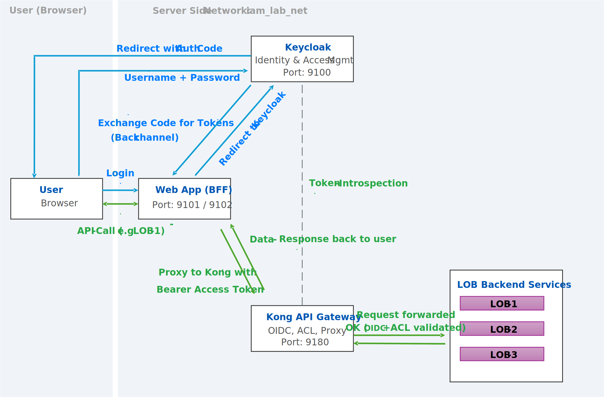

# IAM Lab – Kong, Keycloak, LDAP & .NET Demo

This repository contains a small **Identity & Access Management (IAM) lab** that demonstrates:

- Single sign-on (SSO) with **Keycloak**
- API protection with **Kong** using a custom `oidc-role` plugin
- A simple **OpenLDAP** directory with demo users
- Three protected **line-of-business (LOB)** services
- Two **.NET 8 BFF web applications** that sign users in via OIDC and call the LOB services through Kong

The goal is to provide a self-contained playground to experiment with OpenID Connect, role-based access control, and API gateways.

---

## Architecture overview

**Docker Compose services** (see `docker-compose.yml`):

- **openldap** – LDAP directory with demo users (IT & Marketing units)
- **openldap-ui** – phpLDAPadmin web UI for browsing the LDAP directory
- **keycloak** – Keycloak 26.2 with `IAM_Lab_Realm` imported from `keycloak/config/IAM_Lab_Realm.json`
- **kong** – Kong Gateway with a custom **`oidc-role`** plugin configured in `kong/config/kong.yml`
- **lob1**, **lob2**, **lob3** – minimal .NET 8 APIs returning a JSON “Hello from LOB-X” message
- **webapp1**, **webapp2** – .NET 8 “BFF” style web apps with cookie sessions & OIDC login

All services are attached to the internal `iam_lab_net` Docker network; selected ports are exposed on the host for interactive use.



---

## Prerequisites

- Docker with the Compose plugin (Docker Desktop or Docker Engine 20+)
- ~4 GB free RAM recommended
- A host IP or hostname that matches your desired external URLs

> The example configuration uses `http://10.0.0.50` as host in several places (Keycloak, WebApps, Kong).  
> For local use you can either adapt those values to your own IP/hostname or access the services via `localhost` using the mapped ports shown below.

---

## Services & ports

After `docker compose up` the main endpoints are:

| Service         | Description                       | Host URL (default mapping)        |
|-----------------|-----------------------------------|-----------------------------------|
| Keycloak        | IdP & token service               | http://localhost:9100             |
| phpLDAPadmin    | LDAP admin web UI                 | http://localhost:9150             |
| Kong proxy      | Public API gateway entrypoint     | http://localhost:9180             |
| Kong admin API  | Kong admin API                    | http://localhost:9181             |
| WebApp1         | BFF app 1 (calls LOB 1–3)         | http://localhost:9101             |
| WebApp2         | BFF app 2 (same pattern)          | http://localhost:9102             |

Internally, Kong routes the following paths to the LOB services (see `kong/config/kong.yml`):

- `GET /lob1` → container `lob1:8080`
- `GET /lob2` → container `lob2:8080`
- `GET /lob3` → container `lob3:8080`

The custom **`oidc-role`** plugin enforces that only tokens containing the appropriate Keycloak realm roles (e.g. `lob1-user`, `lob2-user`, `lob3-user`) can access the corresponding route.

---

## Demo identities

### Keycloak

Keycloak is started with the realm definition in `keycloak/config/IAM_Lab_Realm.json`:

- Realm: **`IAM_Lab_Realm`**
- Admin user (bootstrap):  
  - Username: `admin`  
  - Password: `admin`

The realm defines LOB-specific realm roles:

- `lob1-user` – may access LOB 1
- `lob2-user` – may access LOB 2
- `lob3-user` – may access LOB 3

And several confidential clients, for example:

- `webapp1-client` – used by **WebApp1**
- `webapp2-client` – used by **WebApp2**
- `kong` – used by **Kong** for token introspection

### LDAP

The LDAP directory is bootstrapped from `ldap/bootstrap.ldif`.

Example entries and passwords:

- `uid=johndoe,ou=IT,dc=iam,dc=lab` → password: `password123`
- `uid=anna.meier,ou=IT,dc=iam,dc=lab` → password: `password456`
- `uid=peter.schmidt,ou=Marketing,dc=iam,dc=lab` → password: `password789`

LDAP admin (for phpLDAPadmin, see `docker-compose.yml`):

- Bind DN: `cn=admin,dc=iam,dc=lab`
- Password: `admin`

> **Note:** This is a demo lab. All credentials are intentionally simple and must **never** be used in production.

---

## Quick start

1. **Clone the repository**

   ```bash
   git clone <this-repo-url>
   cd IAM-LAB
   ```

2. **(Optional) Adjust hostnames / IPs**

   The sample configuration uses `http://10.0.0.50` as external host in:

   - `docker-compose.yml` (Keycloak `KC_HOSTNAME` and WebApp env vars)
   - `keycloak/config/IAM_Lab_Realm.json` (client redirect URIs)
   - `kong/config/kong.yml` (OIDC discovery URL)

   For local use you can either:

   - replace `10.0.0.50` with your machine IP/hostname, **or**
   - keep it as-is and still access services via `http://localhost:<port>` thanks to Docker port mappings.

3. **Start the stack**

   ```bash
   docker compose up --build
   ```

   Wait until all containers show as *healthy* (especially `iam-lab-keycloak` and `iam-lab-kong`).

4. **Log in to Keycloak**

   - Open **http://localhost:9100** in a browser  
   - Log in to the admin console with `admin` / `admin`
   - Verify that the realm **IAM_Lab_Realm** and clients (e.g. `webapp1-client`) are present

5. **Open WebApp1**

   - Navigate to **http://localhost:9101**
   - Click **Login** – you are redirected to Keycloak
   - Log in with any demo user that exists in the realm / LDAP (e.g. `johndoe` if configured in Keycloak)
   - Use the **“Call LOB 1 / 2 / 3”** buttons to trigger API calls via Kong

   WebApp1 will:

   - sign the user in via OIDC (Authorization Code + PKCE)
   - store access/ID tokens in session
   - call Kong (`KONG_API_URL`, default `http://kong:8000`) with the **Bearer** token
   - display the JSON response from `lob1`/`lob2`/`lob3`

6. **Experiment with roles & access**

   - In Keycloak, assign the roles `lob1-user`, `lob2-user`, `lob3-user` to different users
   - Call LOB 1–3 again from WebApp1
   - Observe how the **`oidc-role`** plugin allows or denies requests depending on the realm roles in the token

---

## Project structure

```text
docker-compose.yml          # Main orchestration file
keycloak/
  config/IAM_Lab_Realm.json # Keycloak realm, clients, roles, mappers
kong/
  Dockerfile                # Builds kong-oidc image with custom plugin
  config/kong.yml           # DB-less Kong declarative config
  oidc/                     # `oidc-role` plugin (handler, schema, utils, session, filter)
ldap/
  bootstrap.ldif            # Demo LDAP tree & users
lob-services/
  Dockerfile                # Shared Dockerfile for LOB1–3
  Program.cs                # Minimal JSON “Hello from {SERVICE_NAME}” API
WebApp1/
  Dockerfile
  Program.cs                # .NET 8 BFF + OIDC + session + /api/call-lobX endpoints
  wwwroot/index.html        # Simple dashboard UI
WebApp2/
  Dockerfile
  Program.cs
  wwwroot/index.html
data-protection/
  webapp1/, webapp2/        # ASP.NET DataProtection key rings (persisted across restarts)
```

---

## Notes & disclaimers

- This project is **for lab / demo purposes only**.
- All secrets, client IDs, passwords, and hostnames are **hard-coded and insecure by design**.
- Always replace credentials, rotate secrets, enforce HTTPS, and tighten session/cookie settings before using any of these patterns in a real environment.
