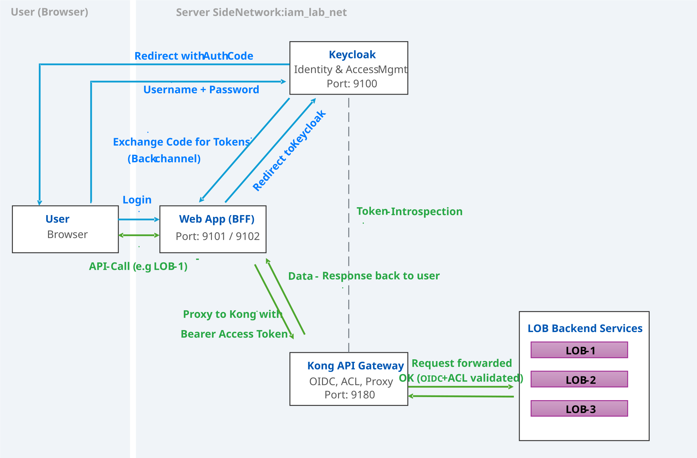

# IAM Lab: Kong, Keycloak, LDAP & .NET Demo

> **Written by Vahid Tavakkoli, 2026**

A hands-on **Identity and Access Management (IAM) lab** that demonstrates how to combine:

- **Keycloak** for identity, OpenID Connect, and role assignments
- **Kong Gateway** (DB-less) for API routing and authorization checks
- **OpenLDAP** as a simple user directory source
- **.NET 8** backend-for-frontend (BFF-style) apps and protected LOB APIs

This repository is designed as a learning and experimentation environment for IAM concepts such as SSO, role-based API protection, and token-based service access.

---

## ⚠️ Demo / Lab Disclaimer

This project is a **demo/lab environment only**.

- Credentials, hostnames, and secrets are intentionally simplified.
- Configuration is intentionally developer-friendly, **not production-safe**.
- Do **not** deploy this repository directly in production.

See [DISCLAIMER.md](DISCLAIMER.md) for details.

---

## Why this repository exists

This lab helps engineers and architects quickly test IAM integration patterns without building all components from scratch. It is useful for:

- local IAM proof-of-concepts
- role and policy experiments
- gateway/OIDC plugin prototyping
- onboarding and demo workshops

---

## Architecture at a glance

The stack is orchestrated with Docker Compose and includes:

- **openldap**: LDAP directory with demo users
- **openldap-ui**: phpLDAPadmin for browsing LDAP
- **keycloak**: Identity Provider with preloaded realm
- **kong**: API Gateway with custom `oidc-role` plugin
- **lob1 / lob2 / lob3**: protected .NET LOB APIs
- **webapp1 / webapp2**: OIDC-enabled .NET web apps



---

## Repository structure

```text
.
├── docker-compose.yml
├── keycloak/
│   └── config/IAM_Lab_Realm.json
├── kong/
│   ├── config/kong.yml
│   └── oidc/               # custom oidc-role plugin
├── ldap/
│   └── bootstrap.ldif
├── lob-services/
│   ├── Program.cs
│   └── LOB.csproj
├── WebApp1/
│   ├── Program.cs
│   └── wwwroot/index.html
├── WebApp2/
│   ├── Program.cs
│   └── wwwroot/index.html
└── docs and governance files
```

---

## Quick start

1. **Clone and enter repository**

   ```bash
   git clone <repo-url>
   cd IAM-LAB
   ```

2. **Build and run services**

   ```bash
   docker compose up --build
   ```

3. **Open primary endpoints**

   - Keycloak: `http://localhost:9100`
   - phpLDAPadmin: `http://localhost:9150`
   - Kong Proxy: `http://localhost:9180`
   - WebApp1: `http://localhost:9101`
   - WebApp2: `http://localhost:9102`

4. **Sign in and test access**

   - log in through one of the web apps
   - call LOB endpoints through Kong
   - adjust user roles in Keycloak and retest

---

## Core functional behavior (unchanged)

- OIDC login flow with Keycloak for web apps
- Cookie/session handling in .NET BFF apps
- Kong route-level role checks via custom plugin
- LOB APIs returning simple JSON responses

---

## Demo credentials (non-production)

- Keycloak admin: `admin` / `admin`
- LDAP admin DN: `cn=admin,dc=iam,dc=lab`
- LDAP admin password: `admin`

Demo user examples are defined in `ldap/bootstrap.ldif`.

---

## Governance and publication-readiness files

- [CONTRIBUTING.md](CONTRIBUTING.md)
- [CHANGELOG.md](CHANGELOG.md)
- [ROADMAP.md](ROADMAP.md)
- [SECURITY.md](SECURITY.md)
- [CODE_OF_CONDUCT.md](CODE_OF_CONDUCT.md)
- [LICENSE](LICENSE) *(MIT)*
- [DISCLAIMER.md](DISCLAIMER.md)

---

## Roadmap

See [ROADMAP.md](ROADMAP.md) for planned improvements.

---

## Contributing

Please read [CONTRIBUTING.md](CONTRIBUTING.md) before opening pull requests.

---

## License

This repository is licensed under the **MIT License**.

See [LICENSE](LICENSE).
